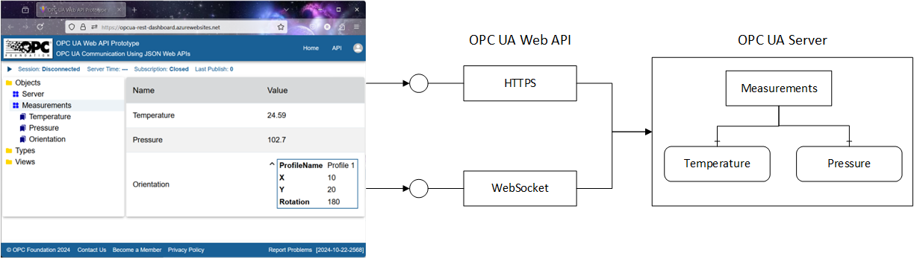

# OPC REST Gateway

This [project](./UaRestGateway.sln) is a React/TypeScript client that runs in a web browser and a OPC UA Server that supports the [OPC UA WebApi](./wwwroot/data/opc.ua.openapi.allservices.json). 

The client application uses OAuth2 to authenticate users with the [OPC Foundation website](https://opcfoundation.org/login). The JSON Web Token (JWT) returned by the OPC Foundation website passed in the HTTP Authorization header. The OPC UA Server also supports basic authentication with these test users:

| Name | Password |
|---|---|
| user1 | password1 |
| user2 | password2 |

The OPC UA Server has two parts: the WebApi implementation and an OPC UA Server. The OPC UA WebApi implementation parses the JSON (decompressing first if necessary) and routes the request to the OPC UA Server running inside the process. The OPC UA Server also supports opc.tcp so any standard OPC UA client can connect to it when it is running locally. When the project is published to the web, all non-HTTPS ports are blocked. The following image illustrates the relationship between the components:

[]

The clean division between the OPC WebApi handler and the OPC UA Server means that the project could be used as a basis for a generic wrapper for any existing OPC UA Server that supports opc.tcp (a future update will include this capability). 

The OPC UA WebApi implementation supports session-less and session based calls. All HTTPS calls are session-less and authentication is done with the JWT passed in the Authorization header. WebSocket calls allow a session to be established. The user identity used with the session is provided when the WebSocket is created using the mechanisms defined in [Part 6](https://reference.opcfoundation.org/Core/Part6/v105/docs/7.5).

Note that the "Measurements.Reset" Method is only visible to AuthenticatedUsers. 

Note that the OPC Foundation login requires a secret assigned by the OPC Foundation website. This secret is not part of the code base for security reasons. Getting the code to work will require that each user provide credentials to their OAuth2 server. This can be done fairly easily by creating a Word Press instance and installing the [OAuth2 plugin](https://wp-oauth.com/documentation/).
